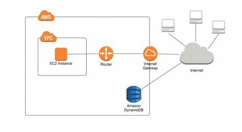
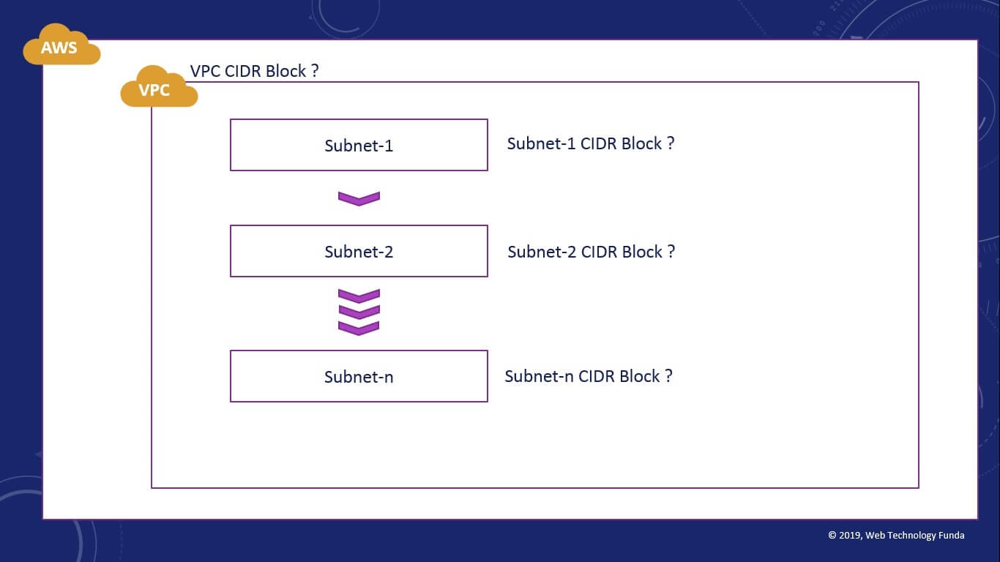
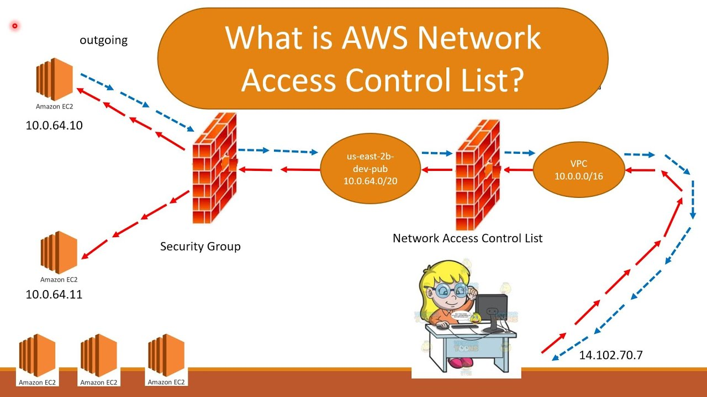
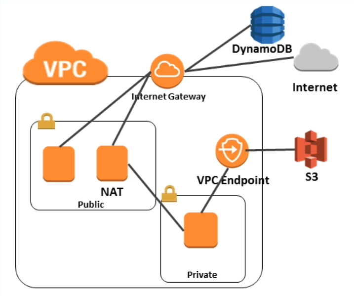
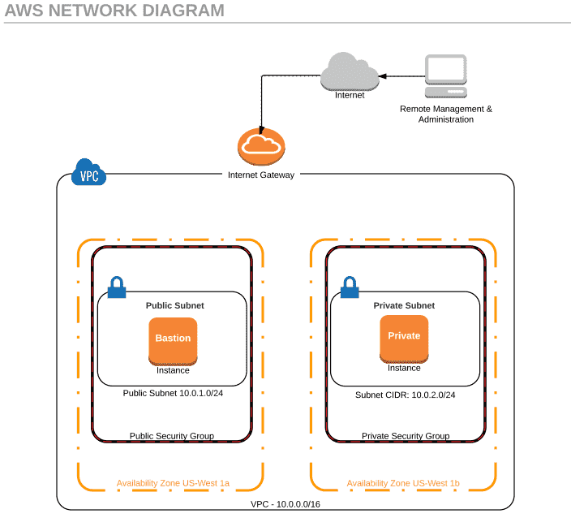

WHAT IS VPC ?

 A VPC gives an enterprise the ability to define and control a virtual network that is logically isolated from all other public cloud tenants, 
creating a private, secure place on the public cloud.

WHAT ARE THE BENEFITS ?

Flexible business growth: Because cloud infrastructure resources—including virtual servers, 
storage, and networking—can be deployed dynamically, 
VPC customers can easily adapt to changes in business needs.

Satisfied customers: In today’s “always-on” digital business environments, customers to always have high levels of online quality. 
The high availability of VPC environments enables reliable online experiences that build customer loyalty and increase trust in your brand.

Reduced risk across the entire data lifecycle: VPCs enjoy high levels of security at the instance or subnet level, or both. 
This gives you peace of mind and further increases the trust of your customers.

More resources to channel toward business innovation: With reduced costs and fewer demands on your internal IT team,
 you can focus your efforts on achieving key business goals and exercising core competencies.

WHAT IS CIDR? :

Classless inter-domain routing (CIDR) is a method 
for allocating IP addresses and IP routing. 
A collection of Internet Protocol (IP) standards is used to create unique identifiers for networks and individual devices. The IP addresses allow the transmission of unique packets of
 information to specific computers.

WHAT IS NACL?

An optional layer of security that acts as a firewall for controlling traffic in and out of a subnet.
 You can associate multiple subnets with a single network ACL, but a subnet can be associated with only one network ACL at a time.

WHAT IS INTERNET GATEWAY?

An internet gateway is a horizontally scaled, redundant, and highly available VPC component that allows communication between your VPC and the internet.
  An internet gateway enables resources (like EC2 instances) in your public subnets to connect to the internet if the resource has a public IPv4 address or an IPv6 address.
  Similarly, resources on the internet can initiate a connection to resources in your subnet using the public IPv4 address or IPv6 address.
  For example, an internet gateway enables you to connect to an EC2 instance in AWS using your local computer.

An internet gateway serves two purposes: to provide a target in your VPC route tables for internet-routable traffic, and to perform network address translation (NAT)
  for instances that have been assigned public IPv4 addresses. For more information, see Enable internet access.

An internet gateway supports IPv4 and IPv6 traffic. It does not cause availability risks or bandwidth constraints on your network traffic

WHAT IS a SUBNET ?

A subnet, or subnetwork, is a segmented piece of a larger network.
 More specifically, subnets are a logical partition of an IP network into multiple, smaller network segments. 
The Internet Protocol (IP) is the method for sending data from one computer to another over the internet.
 Each computer, or host, on the internet has at least one IP address as a unique identifier.

Organizations will use a subnet to subdivide large networks into smaller, more efficient subnetworks.
 One goal of a subnet is to split a large network into a grouping of smaller, interconnected networks to help minimize traffic.
 This way, traffic doesn't have to flow through unnecessary routs, increasing network speeds.

