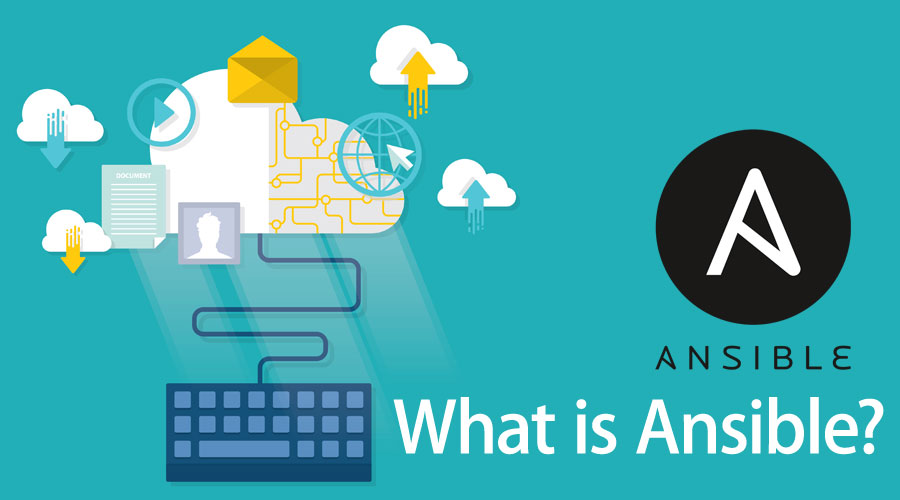

How to connect The CONTROLLER TO THE WEB AND DB MACHINES:

ssh vagrant controller 

sudo apt-get update -y

To connect into the WEB OR DB : 

    ssh vagrant@192.168.33.10 ( the web address )
    
    ssh vagrant@192.168.33.11 ( the db address ) 
    
    ssh vagrant@192.168.33.12( the controller address)
    
NEXT STEP :  PROVIDE PASSWORD

To exit we do : exit back to the controller

sudo apt-get install software-properties-common

sudo apt-add-repository ppa:ansible/ansible

sudo apt-get install ansible -y
#install ansible

cd etc

cd ansible

/etc/ansible$ ansible web -m ping
 sudo nano hosts ( [web]
192.168.33.10 ansible_connection=ssh ansible_ssh_user=vagrant ansible_ssh_pass=vagrant)

CHECK IT AGAIN :
/etc/ansible$ ansible web -m ping

RESULT:
192.168.33.10 | SUCCESS => {
    "ansible_facts": {
        "discovered_interpreter_python": "/usr/bin/python"
    },
    "changed": false,
    "ping": "pong"
}

SET UP THE HOST FOR DB AS WELL:
[db]
192.168.33.11 ansible_connection=ssh ansible_ssh_user=vagrant ansible_ssh_pass=vagrant

What is IAC ?

Infrastructure as Code (IaC) uses a high-level descriptive coding language to automate the provisioning of IT infrastructure. 
This automation eliminates the need for developers to manually provision and manage servers, operating systems, database connections, storage, and other infrastructure elements every time they want to develop, test, or deploy a software application.

BENEFITS:

Faster time to production/market: IaC automation dramatically speeds the process of provisioning 
infrastructure for development, testing, and production (and for scaling or taking down production infrastructure as needed). Because it codifies and documents everything, IaC can even automate provisioning of legacy infrastructure, which might otherwise be governed by time-consuming processes (like pulling a ticket).

Improved consistency—less ‘configuration drift’: Configuration drift occurs when ad-hoc configuration changes and updates result
in a mismatched development, test, and deployment environments. This can result in issues at deployment, security vulnerabilities, and risks when developing applications and services that need to meet strict regulatory compliance standards. IaC prevents drift by provisioning the same environment every time.

Faster, more efficient development: By simplifying provisioning and ensuring infrastructure consistency, IaC can confidently accelerate every phase of the software delivery lifecycle. Developers can quickly provision sandboxes and continuous integration/continuous deployment (CI/CD) environments. QA can quickly provision full-fidelity test environments. Operations can quickly provision infrastructure for security and user-acceptance testing. And when the code passes testing, the application and the production infrastructure it runs on can be deployed in one step.

Protection against churn: To maximize efficiency in organizations without IaC, provisioning is typically delegated a few skilled engineers or IT staffers. If one of these specialists leaves the organization, others are sometimes left to reconstruct the process. IaC ensures that provisioning intelligence always remains with the organization.

Lower costs and improved ROI: In addition to dramatically reducing the time, effort, and specialized skill required to provision and scale infrastructure, IaC lets organizations take maximum advantage of cloud computing’s consumption-based cost structure. It also enables developers to spend less time on plumbing and more time developing innovative, mission-critical software solutions.

WHAT IS CONFIGURATIONS MANAGEMETNT AND ORHCHESTRTION WITH IAC ?
Maintains the consistency of an application’s performance, 
as well as its functional and physical inputs along with requirements, overall design, and operations throughout the lifespan of the product.

WHAT IS ANSIBLE ?

Ansible is an open-source software provisioning, configuration management, and application-deployment tool.
It runs on many Unix-like systems, and can configure both Unix-like systems as well as Microsoft Windows. 

Infrastructure as Code (IaC) is a core part of the DevOps domain and is a core skill that DevOps engineers must possess. IaC is used to provision and manage the IT infrastructure using configuration code that is machine-readable definition files. Using this software engineering approach towards operations, you can automate the IT infrastructure using programming scripts.

When a DevOps engineer thinks about automation using code in DevOps, two DevOps tools always get highlighted, Terraform and Ansible. Both are top-rated and widely used tools in the DevOps domain.

How to create the CI/CD pipeline ?

STEP1: create the EC2 instance
STEP2 : in jankins :

1) create a job 

2) use pem key to connect to EC2 instance
   chmod 400 flask.pem

3) in the script shell:

 
scp -i 114.pem app ubuntu@(PUBLIC IP):

   -- scp the APP folder into the EC2
   -- install node js for the eEC2

When all that is done:

from the localhost SSH into EC2

from localhost

npm install
npm start 

and it should run it.
============

My own VPC:

HELLLOO
-adding to github

WHAT IS VPC ?

 A VPC gives an enterprise the ability to define and control a virtual network that is logically isolated from all other public cloud tenants, 
creating a private, secure place on the public cloud.

WHAT ARE THE BENEFITS ?

Flexible business growth: Because cloud infrastructure resources—including virtual servers, 
storage, and networking—can be deployed dynamically, 
VPC customers can easily adapt to changes in business needs.

Satisfied customers: In today’s “always-on” digital business environments, customers to always have high levels of online quality. 
The high availability of VPC environments enables reliable online experiences that build customer loyalty and increase trust in your brand.

Reduced risk across the entire data lifecycle: VPCs enjoy high levels of security at the instance or subnet level, or both. 
This gives you peace of mind and further increases the trust of your customers.

More resources to channel toward business innovation: With reduced costs and fewer demands on your internal IT team,
 you can focus your efforts on achieving key business goals and exercising core competencies.

WHAT IS CIDR? :

Classless inter-domain routing (CIDR) is a method 
for allocating IP addresses and IP routing. 
A collection of Internet Protocol (IP) standards is used to create unique identifiers for networks and individual devices. The IP addresses allow the transmission of unique packets of
 information to specific computers.

WHAT IS NACL?

An optional layer of security that acts as a firewall for controlling traffic in and out of a subnet.
 You can associate multiple subnets with a single network ACL, but a subnet can be associated with only one network ACL at a time.

WHAT IS INTERNET GATEWAY?

An internet gateway is a horizontally scaled, redundant, and highly available VPC component that allows communication between your VPC and the internet.
  An internet gateway enables resources (like EC2 instances) in your public subnets to connect to the internet if the resource has a public IPv4 address or an IPv6 address.
  Similarly, resources on the internet can initiate a connection to resources in your subnet using the public IPv4 address or IPv6 address.
  For example, an internet gateway enables you to connect to an EC2 instance in AWS using your local computer.

An internet gateway serves two purposes: to provide a target in your VPC route tables for internet-routable traffic, and to perform network address translation (NAT)
  for instances that have been assigned public IPv4 addresses. For more information, see Enable internet access.

An internet gateway supports IPv4 and IPv6 traffic. It does not cause availability risks or bandwidth constraints on your network traffic

WHAT IS a SUBNET ?

A subnet, or subnetwork, is a segmented piece of a larger network.
 More specifically, subnets are a logical partition of an IP network into multiple, smaller network segments. 
The Internet Protocol (IP) is the method for sending data from one computer to another over the internet.
 Each computer, or host, on the internet has at least one IP address as a unique identifier.

Organizations will use a subnet to subdivide large networks into smaller, more efficient subnetworks.
 One goal of a subnet is to split a large network into a grouping of smaller, interconnected networks to help minimize traffic.
 This way, traffic doesn't have to flow through unnecessary routs, increasing network speeds.

