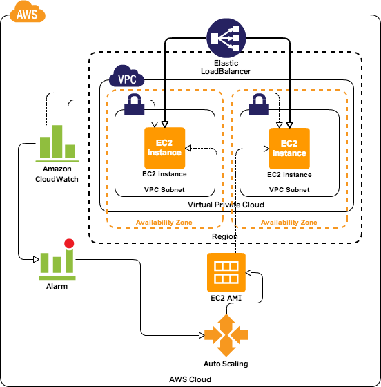
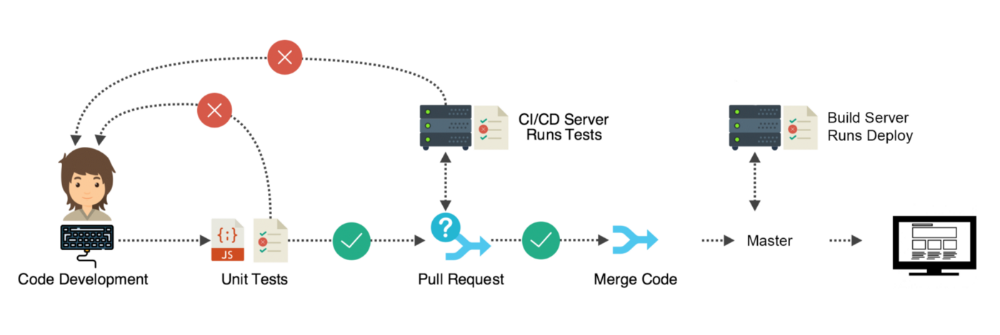

DOCUMENTATION FOR Autoscaling and Load Balancing :

Application Load Balancer 

1) Autoscaling automatically adjusts the amount of computational resources 
   based on the server load
2) Load Balancing distributes traffic between EC2 instances so that no one
   instance gets overwhhelmed.

First the planning is done -- then we will build it.
Autoscalling group helps us scale on demand and the load balancer -balances 
the instances actively available.

When we create an autoscaling group we need to pland and design in advance and we
need to decide :

1) the min  - 2- number of isntances which we would like to run.
2) max number -3-  : when the traffic increases how many more instances would you like to 
   spin up ; 
3) desired -2 - 

IMPORTANT : to resolve the problem of single point failure we need to run min 2;

So if there is a porblem the load balancer should stop sending traffic to the inactive 
instance and redirect all the traffic to the instance which is responding.
( STATUS CODE: 200 )

Autoscling group terminates that instance and replaces it with  the new instance.

As soon as the other instance becomes available, the Load Balancer redirects the traffic
to that instance.

So if there are 2 EC2 instances dealing with a lot of traffic, if one is not working anymore
Load Balancer is notified and redirect the traffic to the other EC2 instance.
Auto Scalling group is generating a instance and notifies the Load balancer to redirect
the traffic between the 2 instances.

When creating the group we need to decide the min and max number of instances running.
If the traffic increases : scale out.
When the traffic goes down : scale in.

When creating the instances we can create a template -- which can be used for all of them--

There are a few things which we need to consider in order to create :auto-scaling group and load balancer:

1) Launch template
2) Type of Load Balancer : we choose application load balancer ( for a web appp)
 with target group/listener group HTTP ( the load balancer si dealing with an external traffic which is form of HTTP-
 the load balancer needs to be able to listen to that -accept the request and foward it on ) 

3) create an application load balancer - attach the required dependecies;
4) auto-scaling group - attach this to LB;

So a lot of services are connected to each other ; 

For all these services we need :

1) app running 
2) monitoring in place -- which triggers the notification so that we ;
3) attach the autoscaling gorup 
4) make it highliy available and scalable

The instances created are on differnt availability zones : if one zone is not working,
the traffic will be redirected

What the auto-scaling group will do ,it will do by following the given instruction in the
autoscaling availability policy and we create that in the beginning.

STEP1 : lunch the template

1) launch template name: eng114-bogdana
2) auto-scaling guidance -enable
3) ad tags
4) application and OS Images : Ubuntu 8.04
5) instance type : t2.micro ;
6) select the key : eng114 (this will be attached to all of these instances) 
7) in the security group select : the app security group ; 
8) in the Advance options  we include in the USER DATA the following script:
  
#!/bin/bash 

sudo apt-get update -y 
sudo apt-get update -y
sudo apt-get install nginx -y

sudo systemctl restart nginx
sudo systemctl enable nginx

=======
STEP2 : use this template to launch an autoscaling group together 
with the load balancer.

SELECT : autoscaling group :

1) Name the autoscaling group; 
2) Select the launch template which you have created
3) NetworK : default is Irland /other availability zones:
  eu-west -a1/eu-west-b1/eu-west-c1;
4) Attach a new load balancer > Application load balancer ;
5) Give it a name
6) Internet -facing
7) create a new target group with a  name for the Load Balancer
8) groups size : desired 2/min 2/max 3
9)scaling policy: metric type : average CPU utilization 

The Auto-Scale group will run 2 instances at the same time ; if we terminate one instance it will generate another one;the process will
repeat because we have set it to run to a min of 2 instances.
If we paste the IP of any instance in the browser NGINX will get displayed.

The only way for this process to stop is to delete the Auto-Scale group.

What is the difference between CD & CDE use cases?

CI CD is considered as the backbone of DevOps practices and automation, 
It plays vital, challenging and exciting role in DevOps culture,
 growing numbers of companies releasing software in minutes with the adoption of CICD practices.

Approximately 2400 companies reportedly use CICD pipelines in their tech stack, 
including Facebook, Netflix, and Instacart, predominantly to gain the benefits of Faster software builds,
 customer satisfaction by deploying the app in time, Small code changes make fault isolation simpler and quicker, 
are the few advantages.

Continuous Integration (CI): Developers merge/commit code to master branch multiple times a day,
 fully automated build and test process which gives feedback within few minutes,
 by doing so, you avoid the integration hell that usually happens when people wait for 
release day to merge their changes into the release branch.

Continuous Delivery is an extension of continuous integration to make sure that you can release 
new changes to your customers quickly in a sustainable way. This means that on top of having automated your testing,
 you also have automated your release process and you can deploy your application at any point of time by clicking on a button.
 In continuous Delivery the deployment is completed manually.

Continuous Deployment goes one step further than continuous delivery, with this practice, every change that passes all 
stages of your production pipeline is released to your customers, there is no human intervention, 
and only a failed test will prevent a new change to be deployed to production.

How CICD Practices relate to each other: To put it simply, the continuous integration is part of both continuous delivery and continuous deployment. 
The main difference is the deployment step, in continuous delivery the deployment is done manually and in continuous deployment it happens automatically.

What is a CI CD Pipeline: The CI/CD pipeline is all about automation: Initiating code builds, automated testing,
 and automated deploying to the staging or production environments. It’s complex and exciting at the same time, but incredibly fast,
 if the output of any stage fails, the next stage will also fail.

What is Jenkins?

Why Jenkins? Multi Billion Dollar companies like Facebook, Netflix and Ebay have adopted Jenkins because of it’s amazing advantages,
 Jenkins is an open-source automation server in which the central build and CI process take place, 
It is a Java-based program with packages for Windows, macOS, & Linux.

Great range of plugins available, Jenkins supports building, deploying, and automating for software development projects, easy installation, simple and user-friendly interface, 
extensible with huge community-contributed plugin resource, easy environment configuration in user interface & supports distributed builds with master-slave architecture.

What are the benefits of CICD pipeline :

Automation of software releases — from initial testing to the final deployment — is a significant benefit of the CI/CD pipeline. 
Additional benefits of the CI/CD process for development teams include the following:

Reducing time to deployment through automation: Automated testing makes the development process more efficient, 
reducing the length of the software delivery process. In addition, continuous deployment and automated provisioning
 allow a developer’s changes to a cloud application to go live within minutes of writing them.
Decreasing the costs associated with traditional software development: Fast development, testing and production (facilitated by automation)
 means less time spent in development and, therefore, less cost.
Continuous feedback for improvement: The CI/CD pipeline is a continuous cycle of build, test and deploy. Every time code is tested, 
developers can quickly take action on the feedback and improve the code.
Improving the ability to address error detection earlier in the development process: In continuous integration, testing is automated
 for each version of code built to look for issues integration. These issues are easier to fix the earlier in the pipeline that they occur.
Improving team collaboration and system integration. Everyone on the team can change code, respond to feedback and quickly respond to any issues that occur.

Why Jenkinns ?

When selecting CI/CD tools, the focus should be on how to optimize and automate the software development process. 
An effective CI/CD pipeline uses open-source tools for integration, testing and deployment.
 Correct configuration of your CI/CD process also impacts the success of the software development pipeline.

The most common open-source CI/CD tool is Jenkins. Jenkins is an automated CI server written in Java and used 
for automating CI/CD steps and reporting. Other open-source tools for integration include Travis CI and CircleCI.

Integrated development environments (IDE), such as GitHub or AWS CodeCommit, help developers create, 
maintain and track software packages, while platforms like GitLab seek to provide the IDE within a comprehensive platform that includes other tools.

